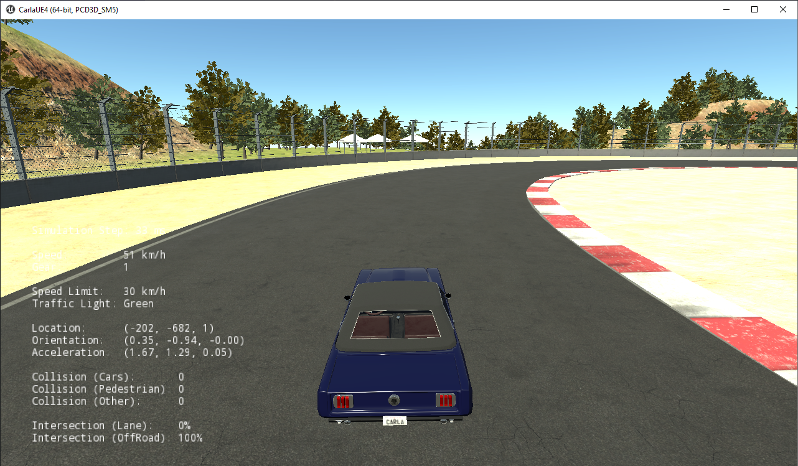
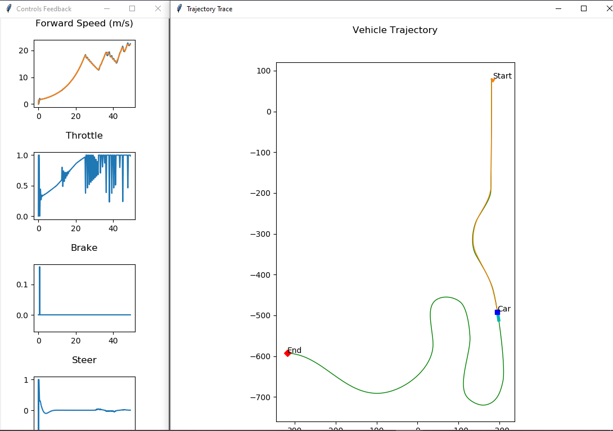

[![Contributors][contributors-shield]][contributors-url]
[![Issues][issues-shield]][issues-url]
[![MIT License][license-shield]][license-url]
[![LinkedIn][linkedin-shield]][linkedin-url]

 

  

<h3 align="center">Self Driving Vehicle Control</h3>

  

    Implementation of a longitudinal and lateral controller in python for the CARLA simulator.
     
    <a href="https://github.com/taoufikayoub/Self-Driving_Vehicle_Control"><strong>Explore the docs »</strong></a>
     
     
    <a href="https://github.com/taoufikayoub/Self-Driving_Vehicle_Control">View Demo</a>
    ·
    <a href="https://github.com/taoufikayoub/Self-Driving_Vehicle_Control/issues">Report Bug</a>
    ·
    <a href="https://github.com/taoufikayoub/Self-Driving_Vehicle_Control/issues">Request Feature</a>
  

## About The Project

This project was part of the Self-Driving Cars Specialization by the University of Toronto on Coursera.
The goal is to control the vehicle to follow a race track by navigating through preset waypoints, and test and validate the results on CARLA's 3D environnement and matplotlib graphs. 

### Control Technologies used

Longitudinal control:
- [PID Control](https://en.wikipedia.org/wiki/PID_controller)

Lateral control:
- [Stanley Control](https://en.wikipedia.org/wiki/Stanley_(vehicle))

## Demo

These are the results of running the simulation with the given course inputs.

### CARLA Simulation Environment

### Controls Feedback & Trajectory trace

## How to run

Please follow these instructions:

1) Follow the CARLA Installation guide [HERE](CARLA-Setup-Guide-_Windows-x64_.pdf) to install the CARLA simulator

2) Move the folder "Vehicle_Control" into the subfolder "PythonClient" inside the "CarlaSimulator" (root) folder.

3) Run module_7.py

<!-- MARKDOWN LINKS & IMAGES -->
<!-- https://www.markdownguide.org/basic-syntax/#reference-style-links -->

[contributors-shield]: https://img.shields.io/github/contributors/taoufikayoub/BlindSupportApp.svg?style=for-the-badge
[contributors-url]: https://github.com/taoufikayoub/BlindSupportApp/graphs/contributors
[forks-shield]: https://img.shields.io/github/forks/taoufikayoub/BlindSupportApp.svg?style=for-the-badge
[forks-url]: https://github.com/taoufikayoub/BlindSupportApp/network/members
[stars-shield]: https://img.shields.io/github/stars/taoufikayoub/BlindSupportApp.svg?style=for-the-badge
[stars-url]: https://github.com/taoufikayoub/BlindSupportApp/stargazers
[issues-shield]: https://img.shields.io/github/issues/taoufikayoub/BlindSupportApp.svg?style=for-the-badge
[issues-url]: https://github.com/taoufikayoub/BlindSupportApp/issues
[license-shield]: https://img.shields.io/github/license/taoufikayoub/BlindSupportApp.svg?style=for-the-badge
[license-url]: https://github.com/taoufikayoub/BlindSupportApp/blob/master/LICENSE.txt
[linkedin-shield]: https://img.shields.io/badge/-LinkedIn-black.svg?style=for-the-badge&logo=linkedin&colorB=555
[linkedin-url]: https://linkedin.com/in/taoufik-ayoub
[product-screenshot]: images/screenshot.png
